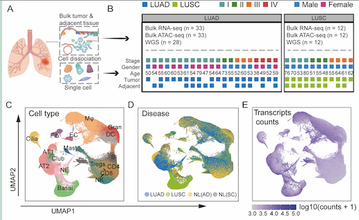

# Lung Cancer 10x

Lung cancer 10X analysis

## DATA AND SOFTWARE AVAILABILITY

- All the raw data of scRNA-seq have been deposited in the https://pms.cd120.com/wcd01/index.html.

- All raw counts, TPM matrix, the Seurat object including expression matrix and cell annotation information of single-cell RNA-seq are available in http://lungcancer.chenlulab.com.

## Scripts used in this project

1. `0_Preprocessing`: Python scripts to call CellRanger, velocyto and scripts to check the sequencing quality
 
2. `1-Figures`:Scripts to perform specific analysis and make figures

3. `2-Others`: Some scripts that related to this project

4. `bak`: Script used in the exploration phase
